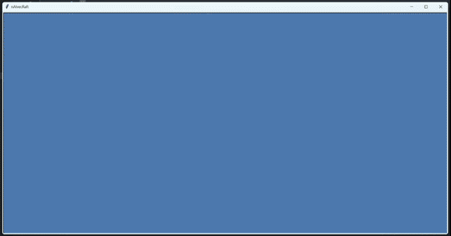

# nAIvecRaft ✈️

> **naive** + **aircraft** — a 2D top-down pixel-art airplane shooter built entirely with Python and Turtle graphics, with all visual assets generated using AI tools.




---

## Gameplay

- Pilot a fighter aircraft over a scrolling ocean
- Dodge and shoot down enemy aircraft
- Survive as long as possible — score increases over time and per kill
- Three lives; colliding with an enemy costs one
- Bullets trigger a multi-frame explosion sequence on hit

---

## Project Structure

```
nAIveCraft/
│
├── main.py                  # Entry point
├── Game.py                  # Game loop, collision detection, event binding
│
├── Core/
│   ├── AnimationEntity.py   # Base class: single turtle, AABB collision, image registration
│   ├── Aircraft.py          # Extends AnimationEntity: movement, shape-change lookup
│   ├── Environment.py       # Extends AnimationEntity: multi-sprite pool, spawn/collision logic
│   └── HUD.py               # Score and lives display, game-over screen
│
├── Aircrafts/
│   ├── Player.py            # Player aircraft (4 bank frames)
│   ├── Enemy.py             # Single enemy aircraft
│   ├── Enemies.py           # Enemy pool manager: spawn, scroll, random movement
│   ├── Bullet.py            # Single bullet (AnimationEntity)
│   └── Bullets.py           # Bullet pool manager: fire-rate cooldown, cleanup
│
├── Environment/
│   ├── Waves.py             # Animated ocean waves (cyclic frame animation)
│   ├── Clouds.py            # Cloud sprites (shape randomised on respawn)
│   ├── Lands.py             # Island sprites (rare, slow scroll)
│   ├── Explosion.py         # Single explosion (AnimationEntity, 5-frame sequence)
│   └── Explosions.py        # Explosion pool manager: add, update, cleanup
│
├── Preprocessing/
│   └── convertion.py        # Converts PNG assets → GIF for Turtle compatibility
│
└── assets/
    ├── demo.gif             # Gameplay demo
    ├── aircrafts/
    │   ├── player/          # normal.gif, left1.gif, left2.gif, right1.gif, right2.gif
    │   └── enemy/           # normal.gif, left.gif, right.gif
    ├── environment/
    │   ├── waves/light/     # _wave_frame_0.gif … _wave_frame_23.gif
    │   ├── clouds/          # cloud0.gif … cloud9.gif
    │   └── lands/           # land0.gif … land14.gif
    └── projectiles/         # bullet.gif, explosion0.gif … explosion4.gif
```

---

## Prerequisites

### Python 3.10+

Download from [python.org](https://www.python.org/downloads/).

### tkinter

`turtle` is part of the standard library but depends on `tkinter`.  
It is bundled automatically on Windows and macOS.  
On Linux, install it manually:

```bash
# Debian / Ubuntu
sudo apt install python3-tk

# Fedora
sudo dnf install python3-tkinter

# Arch
sudo pacman -S tk
```

### Python dependencies

```bash
pip install -r requirements.txt
```

`requirements.txt` contains:

```
Pillow
```

---

## Asset Pipeline

All sprites were created through the following pipeline:

| Step | Tool | Purpose |
|------|------|---------|
| 1 | [ChatGPT](https://chat.openai.com) / [Gemini](https://gemini.google.com) | Generate pixel-art sprites (aircraft, bullets, waves, clouds, lands, explosions) |
| 2 | [Photoroom](https://www.photoroom.com/tools/background-remover) | Remove backgrounds to get clean transparent PNGs |
| 3 | `Preprocessing/convertion.py` | Batch-convert PNGs → transparent GIFs for Turtle compatibility |
| 4 | [Ezgif](https://ezgif.com/) | Manual fallback for GIF conversion and resizing when `convertion.py` produces incorrect results |

### Running the preprocessor

```bash
python Preprocessing/convertion.py
```

Pre-converted GIFs are already included in the repo — this step is only needed when adding or replacing assets.

---

## Running the Game

```bash
python main.py
```

---

## Controls

| Key | Action |
|-----|--------|
| `←` | Bank left |
| `→` | Bank right |
| `Space` | Fire bullet |
| `Q` | Quit |

---

## Scoring

| Event | Points |
|-------|--------|
| Survival | +1 per frame (~60/sec) |
| Enemy destroyed | +100 |

---

## Architecture Notes

- **`AnimationEntity`** is the shared base for everything that owns a turtle: registers its images with the screen automatically, exposes AABB collision via `is_collided_with()`, and provides `x`, `y`, `top`, `bottom`, `left`, `right` properties.
- **`Environment`** extends it to manage a *pool* of turtles instead of one, with non-overlapping spawn logic and a `_on_respawn()` hook used differently by each subclass.
- **`Aircraft`** extends it for controllable sprites, adding movement/shape-change lookups and sinusoidal vibration.
- **Z-ordering** in Turtle is determined by creation order — the instantiation sequence in `Game.setup()` is intentional (waves → land → clouds → enemies → explosions → bullets → player).
- **Fire rate** is enforced in `Bullets` via a per-instance cooldown decremented each frame by `tick()`, independent of how fast the player taps Space.
- **Simultaneous input** (move + fire) is handled by tracking key state in a `set` and processing movement inside the game loop, avoiding Turtle's single-key-at-a-time limitation.